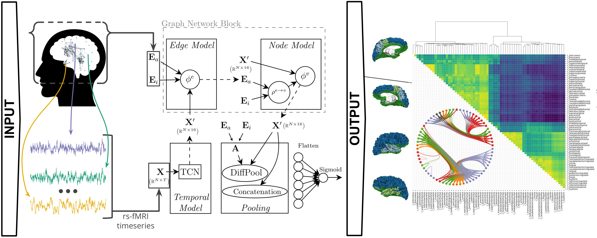

[](https://github.com/tjiagoM/spatio-temporal-brain/blob/master/LICENSE)
[](https://doi.org/10.1101/2020.11.08.370288)

# A Deep Graph Neural Network Architecture for Modelling Spatio-temporal Dynamics in rs-fMRI Data



This repository contains an implementation of a deep neural network architecture combining both graph neural networks (GNNs) and temporal convolutional networks (TCNs), which is able to learn from the spatial and temporal components of rs-fMRI data in an end-to-end fashion. Please check the [publications](#publications) at the end of this page for more details on how this architecture was used and evaluated.

If something is not clear or you have any question please [open an Issue](https://github.com/tjiagoM/spatio-temporal-brain/issues).

## Running the experiments

The code in this repository relies on [Weights & Biases](https://www.wandb.com/) (W&B) to keep track and organise the results of experiments. W&B software was responsible to conduct the hyperparameter search, and all the sweeps (needed for hyperparameter search) used are defined in the `wandb_sweeps/` folder. All our runs, sweep definitions and reports are publicly available at our [project's W&B page](https://wandb.ai/st-team/spatio-temporal-brain). In particular, we provide [two reports](https://wandb.ai/st-team/spatio-temporal-brain/reportlist) to briefly organise the main results of our experiments. 

We recommend that a user wanting to run and extend our code first gets familiar with the [online documentation](https://docs.wandb.com/). As an example, we would create a sweep by running the following command in a terminal:

```bash
$ wandb sweep --entity st-team wandb_sweeps/st_ukb_uni_gender_1_fmri_none_nodemeta_mean_128.yaml
``` 

Which yielded an identifier (in this case `qqqjagns`), thus allowing us to run 25 random sweeps of our code by executing:
```bash
$ wandb agent st-team/spatio-temporal-brain/qqqjagns --count=25
```

The wandb agent will execute `main_loop.py` with its set of hyperparameters (as defined in all the `*.yaml` files inside the `wandb_sweeps` folder). Note that we use a different sweep file for each cross validation fold.


## Python dependencies

The file `meta_data/st_env.yml` contains the exact dependencies used to develop and run this repository. In order to install all the dependencies automatically with [Miniconda](https://docs.conda.io/en/latest/miniconda.html) or [Anaconda](https://anaconda.org/), one can easily just run the following command in the terminal to create an Anaconda environment:

```bash
$ conda env create -f meta_data/st_env.yml
$ conda activate st_env
```

The main packages used by this repository are:
* __matplotlib__==3.1.3
* __networkx__==2.4
* __pandas__==1.0.2
* __python__==3.7
* __pytorch__==1.4.0
* __scikit-learn__==0.22.2
* __seaborn__==0.10.1
* __torch-geometric__==1.4.2
* __wandb__==0.8.31


## Repository structure

The main entry point to understand how things work is the file executed by the wandb agent: `main_loop.py`. This file includes all the code necessary to read the hyperparameters defined from the wandb agent and train a model accordingly. The files it needs are mostly in the root of this repository:
 * `datasets.py`: Classes to load datasets into memory, specifically `HCPDataset` for the Human Connectome Project, and `UKBDataset` for the UK Biobank. They all inherit from `BrainDataset`, which is created according to Pytorch Geometric's `InMemoryDataset` class. 
 * `model.py`: where the main spatio-temporal model of this repository is, with the name `SpatioTemporalModel`, which is created according to different flags passed as arguments.
 * `tcn.py`: TCN adaptation, originally taken from: https://github.com/locuslab/TCN/blob/master/TCN/tcn.py
 * `utils.py`: Many utility functions. Notice the enums defined at the very beginning (e.g., SweepType, Normalisation, DatasetType, etc), which represent the flags that can be defined by the wandb agent, or more generally in the code. 
 * `utils_datasets.py`: Many constant variables specifically needed for dataset handling. 

With regards to the folders in this repository:
 * `encoders`: old files with implementations of autoencoders which we tried (and are defined as possible flags in `utils.py`); however, the results using these models were never good and therefore do not appear in paper. 
 * `meta_data`: some ("meta") files needed for this repository.
 * `outputs`: old output files from preliminary work using the Human Connectome Project (see [publications](#publications) ). Back then, we were not using _Weights & Biases_ yet so we leave the output in this folder
 * `post_analysis`: Variety of files mostly used for post analysis scripts used for publication regarding plotting and other analysis. The code is very messy here and some refactoring is meant to be done in the future.
 * `wandb_sweeps`: all the _Weights & Biases_ configuration files


## Data availability

Data cannot be publicly shared in this repository, we are working on giving more information on that as soon as possible.


## Publications

The architecture implemented in this repository is described in detail in [a preprint at BioRxiv](https://doi.org/10.1101/2020.11.08.370288). If you use this architecture in your research work please cite the paper, with the following bibtex:

```
@article{Azevedo2020,
  doi = {10.1101/2020.11.08.370288},
  url = {https://doi.org/10.1101/2020.11.08.370288},
  year = {2020},
  month = nov,
  publisher = {Cold Spring Harbor Laboratory},
  author = {Tiago Azevedo and Alexander Campbell and Rafael Romero-Garcia and Luca Passamonti and Richard A.I. Bethlehem and Pietro Lio and Nicola Toschi},
  title = {A Deep Graph Neural Network Architecture for Modelling Spatio-temporal Dynamics in resting-state functional {MRI} Data}
}
``` 

Two preliminary versions of this work were also presented in two other venues, which can be accessible online:

* _A deep spatiotemporal graph learning architecture for brain connectivity analysis_. EMBC 2020. [DOI: 10.1109/EMBC44109.2020.9175360](https://doi.org/10.1109/EMBC44109.2020.9175360).
* _Towards a predictive spatio-temporal representation of brain data_. Ai4AH @ ICLR 2020. [ArXiv: 2003.03290](https://arxiv.org/abs/2003.03290).